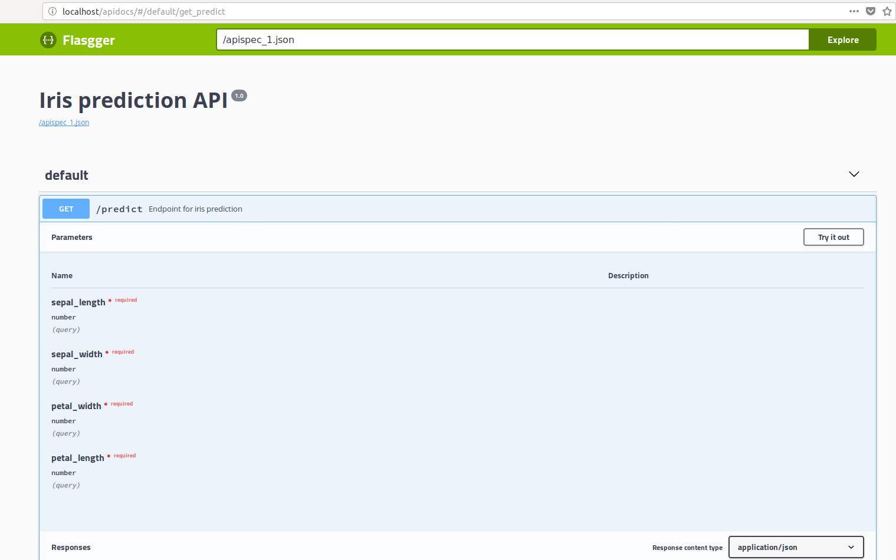

Sample data science project using Flask, Flasgger, uwsgi and nginx
==================================================================

This sample project contains a simple machine learning prediction API considering the traditional [Iris flower](https://en.wikipedia.org/wiki/Iris_flower_data_set) classification problem. It is a REST API implemented with [Flask](http://flask.pocoo.org/), documented with [Flasgger](https://github.com/rochacbruno/flasgger) and served with [uwsgi](https://uwsgi-docs.readthedocs.io/en/latest/) via [Ngnix](https://www.nginx.com/) as a reverse proxy for high performance.

Build
-----

To build the docker image you can simply run `./build-docker-image.sh` from the root folder. You should be on a Unix environment with [Docker](https://www.docker.com/) installed. The `ds-flask-app` image will be created.

Running
-------

After building the docker image, to run it simply issue `./docker-start.sh`. That will create a disposable container running the API. Point your browser to http://localhost/apidocs to check out the Swagger UI. You can try out the predictions right from your browser.

Dev server
----------

To develop locally (without docker) you should have [pipenv](https://docs.pipenv.org/) installed.

To start the development server outside of docker, you should first run `pipenv install` to install all dependencies and then simply execute `./dev-server.sh`.

Training
--------

The API uses an SVM model, which is created by running the `training/create_model.py` file.

Configuration
-------------

Some interesting parameter configurations to try out are `threads` and `processes` on the `uwsgi` conf file in `conf/uwsgi.ini`.